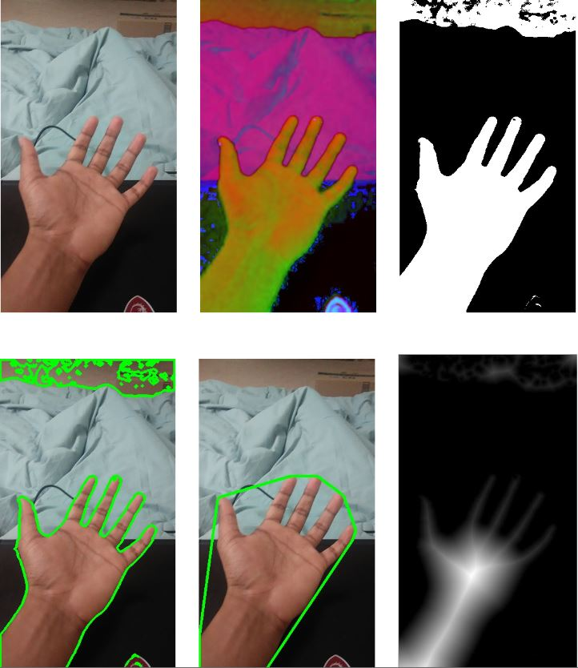
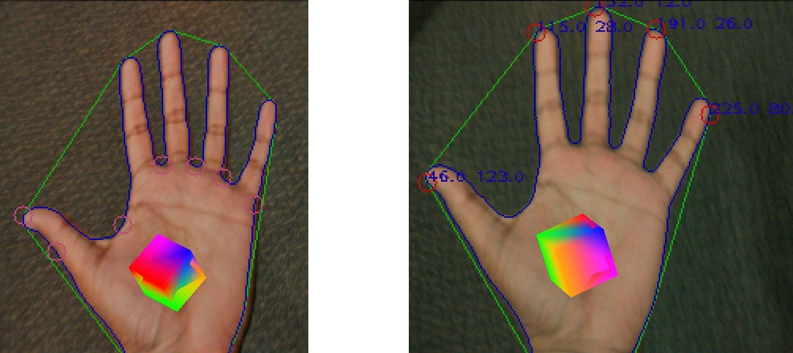

Hand-Detection-AR
========
This is an Augmented Reality Android app. It detects and tracks the user's hand in real time and augments a rotating cube on top of it. The rotation speed can be set by the user by holding up the corresponding number of fingers.

**Watch video [here](https://youtu.be/zdT33t92WN0).**

The methodology, as illustrated above, is:
- Take user input and detect hand color in HSV
- Segment hand and compute convex hull
- Use convex hull to detect fingertips
- Use distance transform to estimate palm center
- Render cube at palm center
- Set cube rotation speed with finger recognition
- Estimate depth with contour size and set cube scale

Screenshot of final app in action:

